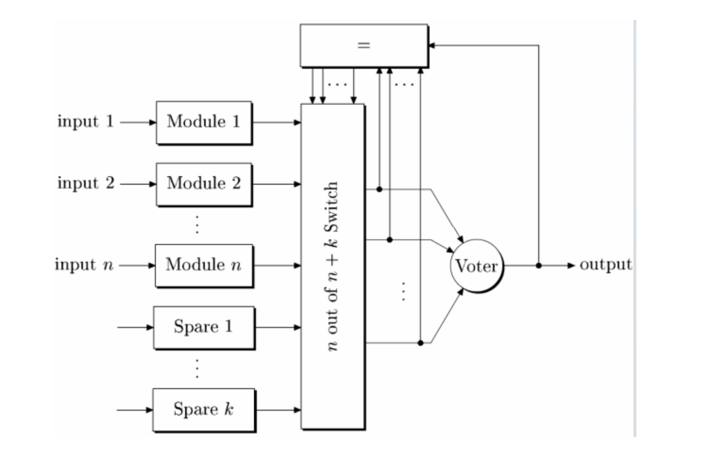

# FIR_Filter_NMR_Spares

This project implements N-Modular Redundancy with Spare Units to enhance fault tolerance in digital systems. The approach involves deploying multiple redundant hardware resources with identical functionality. The system determines the final output based on a majority vote among these redundant components.

Additionally, K spare functional units act as backups, replacing faulty units when needed. The system architecture includes:

N+K Functional Units: Perform identical computations.

Switch Module: Selects N out of N+K signals for voting.

Voter Module: Identifies the most frequent correct output.

Decision Logic: Monitors outputs, detects faulty units, and replaces them with spare components.

By combining redundancy and self-repair mechanisms, this strategy ensures high reliability and fault tolerance, making it ideal for critical applications. In this project, the technique is applied to an FIR filter, where each MAC (Multiply-Accumulate) module is replaced by an N+K redundant MAC unit with integrated switch, voter, and decision logic.

